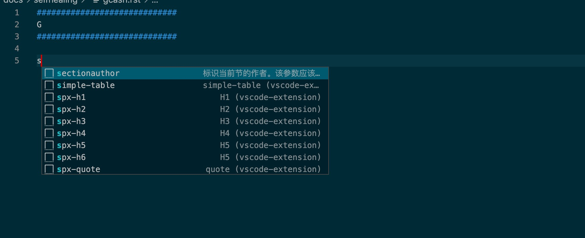

# quick-sphinx-vscode-extension

[quick-sphinx-vscode-extension](https://yishenggudou.github.io/quick-sphinx-vscode-extension/) 用于一些辅助的sphinx文档编写, 能够快速生成不全信息

[github](https://github.com/yishenggudou/quick-sphinx-vscode-extension)

## Features

1. 支持wiki搜索引用
2. 支持google 搜索引用


## 截图




### 快捷键


| snippet  name                | desc     | other    |
|------------------------------|:--------:|---------:|
| `h1`                         |          |          |
| `h2`                         |          |          |
| `h3`                         |          |          |
| `h4`                         |          |          |
| `h5`                         |          |          |
| `h6`                         |          |          |
| `quote`                      |          |          |
| `inline-code`                |          |          |
| `simple-table`               |          |          |
| `table`                      |          |          |
| `list-table`                 |          |          |
| `csv-table`                  |          |          |
| `file-include`               |          |          |
| `file-include-diff`          |          |          |
| `glossary`                   |          |          |
| `sectionauthor`              |          |          |
| `codeauthor`                 |          |          |
| `math-code`                  |          |          |
| `inline-math`                |          |          |
| `rubric-example`             |          |          |
| `matplotlib-file`            |          |          |
| `matplotlib-code`            |          |          |
| `graphviz-code`              |          |          |
| `graphviz-file`              |          |          |
| `inheritance-diagram`        |          |          |
| `inheritance-diagram-muti`   |          |          |
| `todo`                       |          |          |
| `todolist`                   |          |          |


## vscode配置 `.vscode/settings.json`

```json
{
  "python.pythonPath": "venv/bin/python",
  "restructuredtext.confPath": "${workspaceFolder}",
  "editor.detectIndentation": false,
  "editor.insertSpaces": true,
  "editor.tabSize": 3,
  "window.title": "AKKA 架构源码分析",
  "pasteImage.path": "${currentFileDir}/_static",
  "pasteImage.basePath": "${currentFileDir}",
  "files.exclude": {
   "venv": true,
   ".idea": true,
   "_build":true,
  }
}

```


## Known Issues

[issues](https://github.com/yishenggudou/quick-sphinx-vscode-extension/issues)

## Release Notes

1. [0.0.2](https://github.com/yishenggudou/quick-sphinx-vscode-extension/releases/tag/0.0.2)

## 联系

yishenggudou@gmail.com